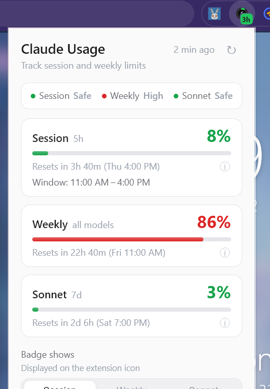
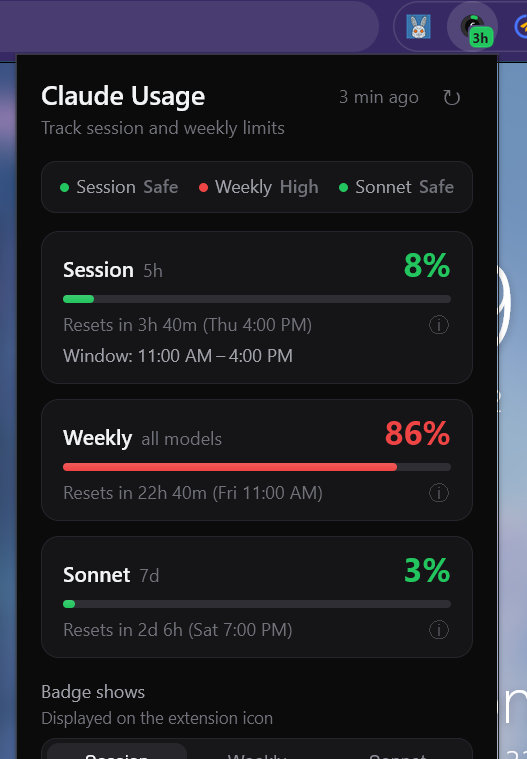

# Claude Usage Deck

Chrome extension that shows your Claude.ai usage limits at a glance — no more navigating to Settings every time.

**[Website](https://max.nardit.com/claude-usage-deck)** · **[Privacy Policy](https://max.nardit.com/claude-usage-deck/privacy)**

  
  

## Features

- **Adaptive badge icon** — solid color at small sizes, ring + percentage at large sizes
- **Countdown badge** — time until reset ("2h", "45m") rendered natively by Chrome
- **Status summary** — instant Safe / Moderate / High indicators for quick decision support
- **Three metrics** — Session (5h), Weekly All Models (7d), Weekly Sonnet (7d)
- **Progress bars** with color-coded status: green (0–49%), amber (50–79%), red (80–100%)
- **Window Anchor Insight** — see when your 5h session window started and when it resets
- **Badge metric selector** — choose which metric the icon displays
- **Light & dark theme** — follows browser/OS preference automatically
- **Manual refresh** + auto-polling every 5 minutes
- **Zero tracking** — no analytics, no accounts, all data stays local

## Window Anchor Insight

**Power user tip:** Your 5-hour usage window starts when you send your first message, floored to the clock hour.

If you send a quick "hi" using Haiku at **6:00 AM**, your window anchors to **6:00–11:00 AM** — even if you don't start real work until 8 AM. This gives you a predictable reset schedule instead of having the window start mid-morning when you're deep in work.

The extension shows this window in the Session metric: `Window: 6:00 AM–11:00 AM`

## Install

1. Clone this repo
2. Open `chrome://extensions`
3. Enable **Developer Mode**
4. Click **Load unpacked** → select the `extension/` folder

## How It Works

The extension polls `claude.ai/api/organizations/{org_id}/usage` every 5 minutes using your browser cookies. All data stays local — nothing is sent anywhere.

## Privacy

No analytics, no tracking, no external servers. Read the full [privacy policy](https://max.nardit.com/claude-usage-deck/privacy).

## License

MIT
